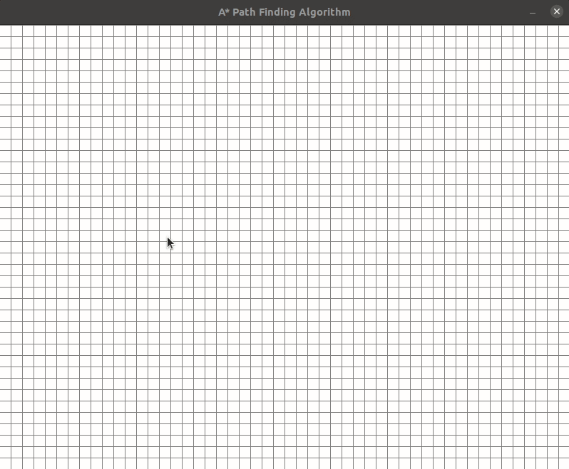

# PathVisualizer
An A* Path Finding Visualizer using Pygame

## Demo


## Development
You need to only install pygame locally

Go to terminal and run
```
pip install pygame
```

This will install pygame

And to run this Visualizer, 
```
python3 astar.py
```

Our Visualizer Window will open, 

1. First click anywhere to set the starting spot

2. Second click will set the ending spot

3. And the rest of the clicks will set the wall/blockage for the path

4. Now click Spacebar to start the visualizer in action

# License
MIT License 2021 (c) [Nilesh Das](LICENSE)

